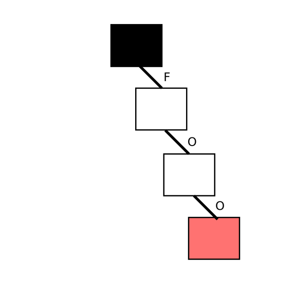

# PackedTrie
A memory-compact, fully dynamic, flat-packed prefix trie with minimal overhead, supporting custom Unicode ranges

## Installation
Requires Python 3.10 or newer

Install by running in your terminal
```
pip install git+https://gits-15.sys.kth.se/grudat25/vsilwer-ovn7
```

## Initialization and Methods
```python
trie = PackedTrie(encoding='ascii', size_class='default')
```

### Arguments
- `size_class`: Decides the scaling of each node's index ability. Each size_class reserves 1 more byte of memory per node, allowing for an ~256 times larger trie at a cost of ~1 extra byte per node. An overfilled trie will throw an OverflowError.
  - options: `"tiny", "default", "large", "massive", "massive+", "massive++"`

- `encoding`: Decides the unicode range each node supports. The wider the range the more memory is reserved per node
  - options:
    - list:                A list of any of the below for disjointed unicode ranges
    - tuple:               A tuple of a range, eg (97, 122) for lowercase latin alphabet
    - set[str]:            A set of allowed chars, eg {"a", "c"}
    - set[int]:            A set of allowed unicode points, eg {97, 99} for "a" and "c"
    - str:                 A predefined unicode range from the ones below
  - Note that each disjoined range is stored as a tuple within a list

**Encoding predefined options**
| Category | langs |
|-|-|
| General | `bmp`, `unicode` |
| ASCII & subsets | `ascii`, `printable_ascii`, `digits`, `punctuation`, `alphanumeric` |
| Symbols | `symbols_math`, `currency_symbols`, `arrows`, `misc_technical` |
| Latin script | `latin_alphabet`, `latin_alphabet_lowercase`, `latin_alphabet_uppercase`, `latin`, `latin_extended_a`, `latin_extended_b` |
| Other scripts | `greek`, `cyrillic`, `hebrew`, `arabic`, `devanagari`, `thai`, `japanese`, `korean`, `hangul_compat`, `cjk` |
| Special formats | `emojis_basic`, `emojis_extended`, `fullwidth_forms` |


### Methods and their time complexity

| Method | Average | Worst Case |
|--------|---------|------------|
| `rebuild()` | `O(n*m)` | – |
| `insert()`, `remove()` | `O(k+m)` | `O(m*k)` |
| `with_prefix()` | `O(m+w)` | `O(m*log k + w)` |
| `__contains__()`, `has_prefix()` | `O(log k + m)` | `O(m*log k)` |
| `__iter__()` | `O(m)` per yielded string | – |
| `__sizeof__()` | `O(log k)` | – |
| `clear()`, `is_empty()`, `__len__()`, `node_count()`, `memory_efficiency()`, `__repr__()`, `allowed_chars()`, `help()` | `O(1)` | – |

**Notation**
- `n`: number of nodes  
- `m`: length of the relevant string  
- `k`: number of unique characters used in the trie  
- `w`: number of strings yielded

## Example usage
```python
trie = PackedTrie(encoding='ascii', size_class='default')
trie.insert("foo")

"foo" in trie           # True
trie.with_prefix("fo")  # ["foo"]
```

## What a trie is
A trie is a way to store strings that allows for fast lookup and efficient prefix matching. Each node in the trie is a character from a string and its children represent possible continuations of that string. For example, a trie with the string "FOO" will look as such;



Here each edge represents a character, and the final "O" node has a flag to indicate it is the end of a string. 
Here’s a trie with multiple strings;


This trie contains the strings "BAR", "FOG", "FOO", "FOOL" and "FOOT"

## What makes this trie special
The most common way to make a trie is to have each node be a dict, where each entry representes a character and has a pointer to said character's node. This is an easy and fast way to build a trie but comes with a memory overhead of potentially hundred of bytes per node.

This trie can cram each node into as few as 4 bytes per node while still allowing the trie to store a dictionary of (conservatively) ~3 000 000 real words using only the latin alphabet. Approximately 18 times the amount of words in the Oxford English Dictionary. You can also customise the trie to make each node 10 bytes. At 10 bytes per node (massive++ size), no current data center has enough RAM to overflow the trie's indexable space.

## The precise data structure
This trie is flat packed, meaning that no parents have pointers to thir children. Each node in this trie is packaged as; its own character, an end-of-word flag, and an index to its children. Each node is kept in a chunk within an array, where all children are grouped together. Through this we can index the first child and do binary search to find the position of the specific child we want to see.
For example, a trie with the strings "A", "B", "C" and "D" will look as such;


The first box in each node is its character, the second the end of word flag and the third with an index to where its children are. Here "B" is a terminal node.

For easier indexing, searching and faster operations, we also have a system to preallocated certain sized chunks. We have 'tiers' of bytearrays which we fit all nodes in. In each bytearray, a chunk of children is given a preallocated space appropiate for 2**tier nodes, starting at tier 0. Through this, at trie containing the strings "ABC", "AC", "B" and "C" will look like;


The 3rd slot in each node has an arrow pointing to the first of its children. Note that this is an index, not a pointer.

## What this trie is not
Despite the trie being designed to be compact in memory through flat-packing, no other memory optimisations have been made- that is to say this it not a Patricia trie, Radix trie or a DAWG. It's simply a very compact plain trie.

## Help
For usage help, run:
```PackedTrie.help()```
It will print available encodings and methods.

## TODO